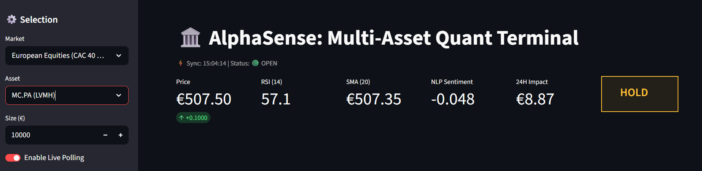
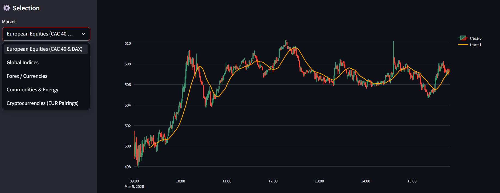
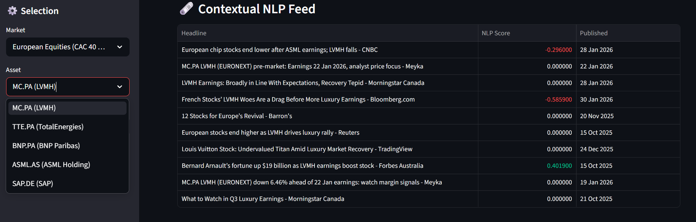

# 📈 AlphaSense: Multi-Asset NLP Quantitative Terminal

[](https://vighnesh-shetty-vs-alphasense-nlp-trading-signal-eng-app-tgpvyl.streamlit.app/)
[](https://www.python.org/)
[](https://www.nltk.org/)
[](https://pypi.org/project/yfinance/)
[](#)

## 📌 Executive Summary
In modern quantitative finance, alpha is generated by identifying sentiment divergences before they are fully priced into the market. 

**AlphaSense** is an enterprise-grade algorithmic trading terminal that fuses **real-time unstructured NLP sentiment** (via financial news parsing) with **high-frequency technical momentum indicators** (SMA, RSI, Volatility). Built with a strong focus on European markets (CAC 40, DAX, ECB Forex) and global assets, this engine provides continuous, sub-minute algorithmic trade decisioning.

---

## 🚀 Live Application & Executive Dashboard
**Access the live command center here:** [AlphaSense Live Deployment](https://vighnesh-shetty-vs-alphasense-nlp-trading-signal-eng-app-tgpvyl.streamlit.app/)

*(Note: Best viewed during active European/US market hours for high-frequency 1-minute price ticks. Cryptocurrencies tick 24/7).*



---

## 🏦 Key Enterprise Features

### 1. Multi-Asset & Multi-Market Redundancy
* **European Focus:** Built to track major Euro-centric drivers, including the CAC 40, Dutch TTF Gas, and EUR Forex pairings.
* **Smart Timeframe Fallbacks:** If an asset's primary market is closed, the data pipeline automatically falls back from `1m` intraday tracking to `1h` extended hours or `1d` macro views, ensuring zero dashboard downtime.



### 2. High-Frequency Polling & Contextual NLP
* **Engine:** Utilizes NLTK's VADER lexicon, optimized for short-form, high-velocity financial headlines.
* **Smart Routing:** Dynamically adjusts RSS scraping queries based on the asset class (e.g., searching `"europe stock earnings market"` for LVMH, but `"crypto token blockchain"` for Bitcoin) to ensure hyper-relevant sentiment scoring.



### 3. Bulletproof Data Architecture
* **Rate-Limit Evasion:** Integrates modern `yfinance` architecture utilizing `curl_cffi` to natively impersonate browser sessions, preventing the `429 Too Many Requests` API bans common in cloud deployments.
* **Cache-Busting & Zero Latency:** Employs Streamlit `@st.cache_data(ttl=15)` to create a high-speed memory layer, eliminating UI freezes when switching between assets while still enforcing strict 15-second data refreshes.

### 4. Quantitative Business Metrics
* **Projected Financial Impact:** Calculates trailing 14-period volatility to project the expected 24-hour financial impact of a standard position size (dynamically formatted to `€` or `$`).
* **Algorithmic Signal Matrix:** Generates automated signals (`STRONG BUY`, `ACCUMULATE`, `DISTRIBUTE`, `STRONG SELL`) only when fundamental sentiment and technical momentum align.

---

## 🛠️ Technical Stack

| Category | Technology | Purpose |
| :--- | :--- | :--- |
| **Frontend UI** | Streamlit | Asynchronous, localized state-updating terminal interface. |
| **Data Ingestion** | `yfinance`, `requests`, `xml.etree` | High-speed API and RSS XML parsing for market data. |
| **Data Science** | Pandas, NumPy | Vectorized calculations for technical indicators (RSI, SMA). |
| **NLP Engine** | NLTK (VADER) | Valence-aware dictionary parsing for unstructured text sentiment. |
| **Visualization** | Plotly (`graph_objects`) | Interactive, high-fidelity candlestick charting. |

---

## 💻 Local Installation & Deployment

1. **Clone the repository:**
   ```bash
   git clone [https://github.com/vighnesh-shetty-vs/AlphaSense-NLP-Trading-Signal-Engine.git](https://github.com/vighnesh-shetty-vs/AlphaSense-NLP-Trading-Signal-Engine.git)
   cd AlphaSense-NLP-Trading-Signal-Engine
   ```
2. **Create a virtual environment & install dependencies:**
   ```bash
   python -m venv venv
    source venv/bin/activate  # On Windows use `venv\Scripts\activate`
    pip install -r requirements.txt
   ```
3. **Launch the Engine:**
   ```bash
   streamlit run app.py
   ```
---

## 🎓 About the Developer
Vighnesh Shetty

* **Academic**: MSc Data Analytics for Business @ KEDGE Business School (Bordeaux, France).

* **Focus**: Bridging the gap between advanced machine learning algorithms and commercial business value in the Fintech and Quantitative Finance sectors.

* **Availability**: Seeking a 6-month Fintech/Data Analytics internship starting between May and November 2026.
